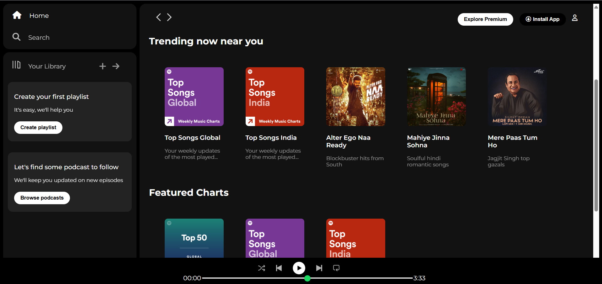

# Spotify Clone - HTML & CSS Project

This is a **clone of the Spotify web player interface**, built using only **HTML and CSS**. The project is fully static and designed to closely resemble the original Spotify layout, including sidebar navigation, a main content area with music cards, and a bottom music player bar.

---

## 🎧 Features

- Sidebar Navigation (Home, Search, Your Library)
- Sticky Top Navbar with Explore & Install buttons
- Responsive Cards for Trending & Recently Played
- Footer Line Section
- Bottom Music Player Layout
- Fully Responsive up to 1000px screen width
- Font Awesome icons and Montserrat font used

---

## 🛠️ Technologies Used

- HTML5
- CSS3
- Google Fonts
- Font Awesome CDN

---

## 📂 Folder Structure

```
/project-folder
│
├── index.html
├── style.css
└── /assets
    ├── logo.png
    ├── library_icon.png
    ├── card1img.jpeg
    ├── card2img.jpeg
    ├── ...
    ├── player_icon1.png
    ├── player_icon2.png
    └── ...
```

---


## 📸 Screenshots

### 🎵 Full Layout



---


## 🌐 Live Demo

[Click here to view the live Spotify Clone](https://gaurii-patil.github.io/spotify-clone/)


---

## 🙋‍♀️ Author

**Gauri Patil**  
Aspiring Full Stack Web Developer 💻

---

## 📄 License

Free to use for learning and educational purposes.
